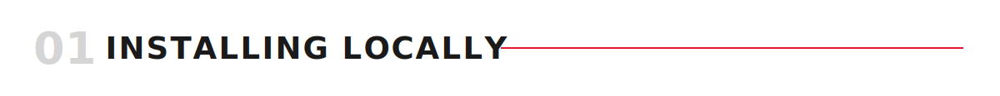
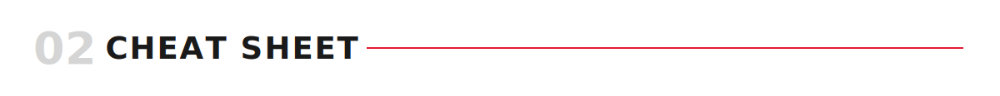

<div align="center">

<picture><source media="(prefers-color-scheme: dark)" srcset="assets/dark/header.svg"/></picture>

<a href="#pages"><picture><source media="(prefers-color-scheme: dark)" srcset="https://img.shields.io/badge/PAGES-0d1117?style=flat-square&logoColor=ffffff"/></picture></a>
<a href="https://github.com/JQInanophotonics/ScientificPresentations"><picture><source media="(prefers-color-scheme: dark)" srcset="https://img.shields.io/badge/PRESENTATIONS-0d1117?style=flat-square&logoColor=ffffff"/></picture></a>
<a href="https://github.com/JQInanophotonics/QuickStartGit"><picture><source media="(prefers-color-scheme: dark)" srcset="https://img.shields.io/badge/QUICKSTART%20GIT-0d1117?style=flat-square&logoColor=ffffff"/></picture></a>

</div>

<picture><source media="(prefers-color-scheme: dark)" srcset="assets/dark/banner-forewords.svg"/></picture>

Every paper the group writes and every talk built in [JqiNanoBeamerTemplate](https://github.com/JQInanophotonics/JqiNanoBeamerTemplate) is LaTeX underneath. This repo assumes **zero prior LaTeX experience** and gets you to a working local setup: install a distribution, compile a document, and get an editor wired up with error highlighting and PDF preview. It does not teach you to write a good paper (structure, argument — that's a future `ScientificWriting`) or to build a good talk (that's [ScientificPresentations](https://github.com/JQInanophotonics/ScientificPresentations)) — both of those assume you can already do what's in this repo. If you'll sync a paper through Overleaf's Git integration, [QuickStartGit](https://github.com/JQInanophotonics/QuickStartGit) is the prerequisite for that part; Git itself isn't otherwise needed here.

Read the pages in order the first time — each builds on the last; use them, and the rules below, as a checklist afterwards — same spirit as [ScientificDataManagement](https://github.com/JQInanophotonics/ScientificDataManagement).

<picture><source media="(prefers-color-scheme: dark)" srcset="assets/dark/banner-installing-locally.svg"/></picture>

```bash
brew install --cask mactex   # macOS
```
Windows: install [MiKTeX](https://miktex.org/download). Linux: `sudo apt install texlive-full` (Debian/Ubuntu) or `sudo pacman -S texlive-meta` (Arch). Check it worked: `pdflatex --version`. Full details, including a lighter macOS option and older-distro fallbacks: [01 — Installing LaTeX](LaTeX/01-Installing.md).

<picture><source media="(prefers-color-scheme: dark)" srcset="assets/dark/banner-cheat-sheet.svg"/></picture>

| Command | What it does |
|---|---|
| `pdflatex --version` | Confirm a LaTeX distribution is installed |
| `latexmk -pdf file.tex` | Compile — default, this is what papers use |
| `latexmk -pvc -pdf file.tex` | Recompile automatically on every save |
| `latexmk -lualatex file.tex` | Compile with LuaLaTeX — **only** for Beamer talks from JqiNanoBeamerTemplate |
| `latexmk -c` | Delete aux/log files, keep the PDF |
| `\cite{BraschScience2016}` | Citation — key format is `<LastName><Journal><Year>` |
| `Cmd`/`Ctrl`-click (VS Code PDF tab) | Jump between source and PDF (SyncTeX) |
| `Ctrl+Alt+B` / `Cmd+Option+B` (VS Code) | Manually trigger a compile |
| `\ll` / `\lv` (Neovim, vimtex) | Compile / forward-search to PDF |

<picture><source media="(prefers-color-scheme: dark)" srcset="assets/dark/banner-everyday-workflow.svg"/></picture>

**Writing:**
```
edit .tex → save (auto-compiles) → check PDF preview → fix errors from the log → repeat
```

**Adding a reference:**
```
add the paper in Zotero → Better BibTeX generates the citekey → \cite{key} in the .tex → recompile
```

<picture><source media="(prefers-color-scheme: dark)" srcset="assets/dark/banner-the-rules.svg"/></picture>

1. **LaTeX is markup, not WYSIWYG** — you write plain text, then compile it to PDF. See [00](LaTeX/00-WhatIsLatex.md).
2. **Install a full distribution once per machine** — MacTeX/MiKTeX/TeX Live. See [01](LaTeX/01-Installing.md).
3. **Papers use plain `pdflatex` — only Beamer talks need LuaLaTeX.** The group's Beamer template needs `lualatex` specifically (it uses `fontspec`); nothing about paper writing does. See [02](LaTeX/02-Compiling.md).
4. **Always compile through `latexmk`**, never call the engine directly — it reruns the right passes for you (bibliography, cross-references). See [02](LaTeX/02-Compiling.md).
5. **Never hand-type a citekey.** Let Zotero + Better BibTeX generate `<LastName><Journal><Year>` for you. See [03](LaTeX/03-BibliographyAndCitations.md).
6. **VS Code + LaTeX Workshop is the easiest path** — one extension, SyncTeX built in. See [04](LaTeX/04-VSCodeSetup.md).
7. **Neovim works too**, via `vimtex` + `texlab`, if that's where you already live. See [05](LaTeX/05-NeovimSetup.md).

<a id="pages"></a>

<picture><source media="(prefers-color-scheme: dark)" srcset="assets/dark/banner-pages.svg"/></picture>

| Page | What it covers |
|------|-----------------|
| [00 — What is LaTeX, and why do we use it?](LaTeX/00-WhatIsLatex.md) | Markup vs. WYSIWYG, why the group uses it, Overleaf as a no-install alternative |
| [01 — Installing LaTeX](LaTeX/01-Installing.md) | MacTeX, MiKTeX, TeX Live — per OS, verifying the install |
| [02 — Compiling](LaTeX/02-Compiling.md) | pdflatex vs. xelatex vs. lualatex, `latexmk`, reading a compile error |
| [03 — Bibliography and citations](LaTeX/03-BibliographyAndCitations.md) | BibTeX for papers (REVTeX), biblatex/biber for Beamer, the citekey convention, Zotero + Better BibTeX |
| [04 — VS Code setup](LaTeX/04-VSCodeSetup.md) | LaTeX Workshop, SyncTeX (built-in tab viewer, or Skim/Zathura/SumatraPDF) |
| [05 — Neovim setup](LaTeX/05-NeovimSetup.md) | vimtex + texlab, with real, copyable dotfiles included |
| [06 — Syntax cheat sheet](LaTeX/06-SyntaxCheatSheet.md) | A minimal working document and the syntax to test your setup |

<picture><source media="(prefers-color-scheme: dark)" srcset="assets/dark/banner-repo-layout.svg"/></picture>

```
LaTeX-QuickHowTo/
├── README.md
├── assets/                    # this README's own banners (light + dark/), not LaTeX content
└── LaTeX/
    ├── 00-WhatIsLatex.md
    ├── 01-Installing.md
    ├── 02-Compiling.md
    ├── 03-BibliographyAndCitations.md
    ├── 04-VSCodeSetup.md
    ├── 05-NeovimSetup.md
    ├── 06-SyntaxCheatSheet.md
    └── dotfiles/
        ├── vimtex.lua
        ├── texlab.lua
        ├── tex-ftplugin.lua
        ├── tex-snippets.lua
        └── tex-syntax.vim
```

<picture><source media="(prefers-color-scheme: dark)" srcset="assets/dark/banner-see-also.svg"/></picture>

Prerequisite for [ScientificPresentations](https://github.com/JQInanophotonics/ScientificPresentations) (build a talk in [JqiNanoBeamerTemplate](https://github.com/JQInanophotonics/JqiNanoBeamerTemplate) once you can compile) and for the future `ScientificWriting` (paper composition and citation practices). If you'll sync a paper through Overleaf, see [QuickStartGit](https://github.com/JQInanophotonics/QuickStartGit) for the Git side of that.
